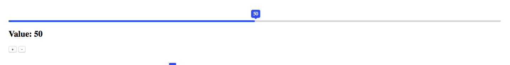
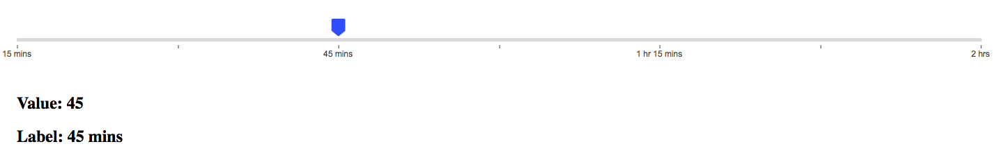
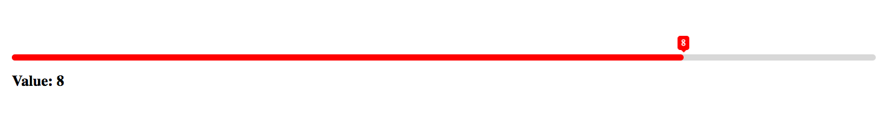
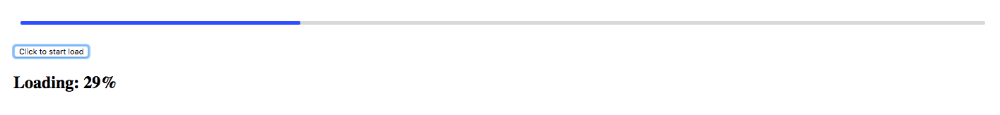

<p>
<a href="https://npmjs.com/package/vue-slide-bar"></a>
<a href="https://npmjs.com/package/vue-slide-bar"></a>
<a href="https://www.npmjs.com/package/vue-slide-bar"></a>
<a href="https://biigpongsatorn.github.io/#/vue-slide-bar"></a>
</p>

# 🎢  Vue Slide Bar

A Simple Vue Slider Bar Component.


# Document & Demo Page
- ### [Document & Demo](https://biigpongsatorn.github.io/#/vue-slide-bar)
- ### [vue-slide-bar-demo-page](https://frncsdrk.github.io/vue-slide-bar-demo-page/)

# Install

```sh
npm install vue-slide-bar --save
```
or
```sh
yarn add vue-slide-bar
```

# Usage
```javascript
// main.js
import Vue from 'vue'
import VueSlideBar from 'vue-slide-bar'

Vue.component('VueSlideBar', VueSlideBar)
```

or

```javascript
// xxx.vue
import VueSlideBar from 'vue-slide-bar'

export default {
  components: {
    VueSlideBar
  }
}
```

## Simple
<center></center>

```html
<template>
  <VueSlideBar v-model="value"/>
</template>

<script>
export default {
  data () {
    return {
      value: 50
    }
  }
}
</script>
```

## With Label
<center></center>

```html
<template>
  <div>
    <VueSlideBar
      v-model="slider.value"
      :data="slider.data"
      :range="slider.range"
      :labelStyles="{ color: '#4a4a4a', backgroundColor: '#4a4a4a' }"
      :processStyle="{ backgroundColor: '#d8d8d8' }"
      @callbackRange="callbackRange">
      <template slot="tooltip" slot-scope="tooltip">
        
      </template>
    </VueSlideBar>
    <h2>Value: {{slider.value}}</h2>
    <h2>Label: {{rangeValue.label}}</h2>
  </div>
</template>

<script>
import VueSlideBar from 'vue-slide-bar'

export default {
  data () {
    return {
      rangeValue: {},
      slider: {
        value: 45,
        data: [
          15,
          30,
          45,
          60,
          75,
          90,
          120
        ],
        range: [
          {
            label: '15 mins'
          },
          {
            label: '30 mins',
            isHide: true
          },
          {
            label: '45 mins'
          },
          {
            label: '1 hr',
            isHide: true
          },
          {
            label: '1 hr 15 mins'
          },
          {
            label: '1 hr 30 mins',
            isHide: true
          },
          {
            label: '2 hrs'
          }
        ]
      }
    }
  },
  methods: {
    callbackRange (val) {
      this.rangeValue = val
    }
  },
  components: {
    VueSlideBar
  }
}
</script>
```

## Custom Style & Min-Max
<center></center>

```html
<template>
  <div>
    <VueSlideBar
      v-model="value2"
      :min="1"
      :max="10"
      :processStyle="slider.processStyle"
      :lineHeight="slider.lineHeight"
      :tooltipStyles="{ backgroundColor: 'red', borderColor: 'red' }">
    </VueSlideBar>
    <h2>Value: {{value2}}</h2>
  </div>
</template>

<script>
import VueSlideBar from 'vue-slide-bar'

export default {
  data () {
    return {
      value2: 8,
      slider: {
        lineHeight: 10,
        processStyle: {
          backgroundColor: 'red'
        }
      }
    }
  },
  components: {
    VueSlideBar
  }
}
</script>
```

## Loading
<center></center>

```html
<template>
  <div>
    <VueSlideBar
      v-model="loading"
      :showTooltip="false"
      :lineHeight="20"
      :isDisabled="true"/>
    <br>
    <button type="button" name="button" @click="startLoad()">
      Click to start load
    </button>
    <h2>Loading: {{loading}}%</h2>
  </div>
</template>

<script>
import VueSlideBar from 'vue-slide-bar'

export default {
  data () {
    return {
      loader: null,
      loading: 0
    }
  },
  methods: {
    startLoad () {
      this.loader = setInterval(() => {
        this.loading++
        if (this.loading === 100) {
          console.log('clear', this.loading)
          clearInterval(this.loader)
        }
      }, 100)
    }
  }
  components: {
    VueSlideBar
  }
}
</script>
```

## Options

### Props
| Props       | Type          | Default  | Description  |
| ----------- |:--------------| ---------|--------------|
| v-model       | Number,String  | 0        | Initial value (v-model)|
| min         | Number        | 0        | Minimum value   |
| max         | Number        | 100      | Maximum value   |
| process-style    | Object | null  | Process bar style. |
| tooltip-style    | Object | null  | Tooltip style. |
| label-style    | Object | null  | Label style. |
| data        | Array         | null     | Custom data. |
| is-disabled       | Boolean        | false      | Flag for disable slider bar |
| draggable      | Boolean       | true     | Flag for active/disable draggable |
| show-tooltip      | Boolean       | true     | Flag display tooltip |
| icon-width       | Number | 20 | Icon width |
| line-height      | Number | 5        | Line height |
| speed       | Number        | 0.5      | Transition time |
| paddingless       | Boolean        | false      | Remove padding and min-height |

### Events
| Name          | Description  |
| --------------|--------------|
| input | triggered on value change |
| callbackRange | triggered on range value change |
| dragStart | triggered on start drag |
| dragEnd | triggered on stop drag |

### Slot
| Name          | Description  |
| --------------|--------------|
| tooltip       | Customize the tooltip slot.|

[#](https://vuejs.org/v2/guide/components.html#Scoped-Slots) When using the template element as a slot, can add special properties `slot-scope` to get the value.

# Contributing
1. Fork this repository.
2. Create new branch with feature name.
3. Run `npm install` and `npm run dev`.
4. Create your feature.
5. Commit and set commit message with feature name.
6. Push your code to your fork repository.
7. Create pull request. 🙂

# Support

```
If you like this project, You can support me with starring ⭐ this repository.
```

## License

[MIT](LICENSE)

Developed with ❤️ and ☕️
